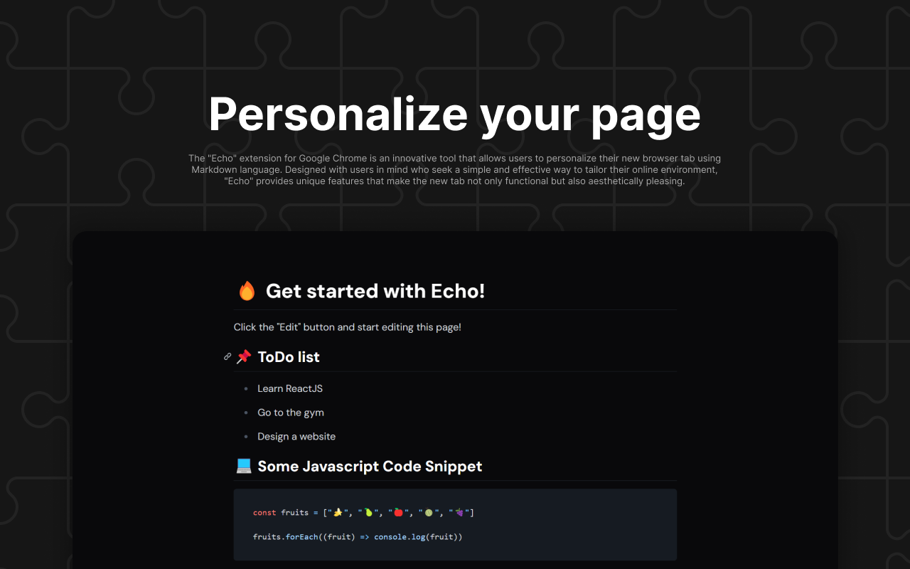

# Echo: Custom Markdown New Tab

## 🙋 About the extension

The Echo extension for Google Chrome is an innovative tool that allows users to personalize their new browser tab using Markdown language. Designed with users in mind who seek a simple and effective way to tailor their online environment, Echo provides unique features that make the new tab not only functional but also aesthetically pleasing.

## 💙 Support

If you like my work, you can support me on
[PayPal](https://www.paypal.com/paypalme/cresvinn)!